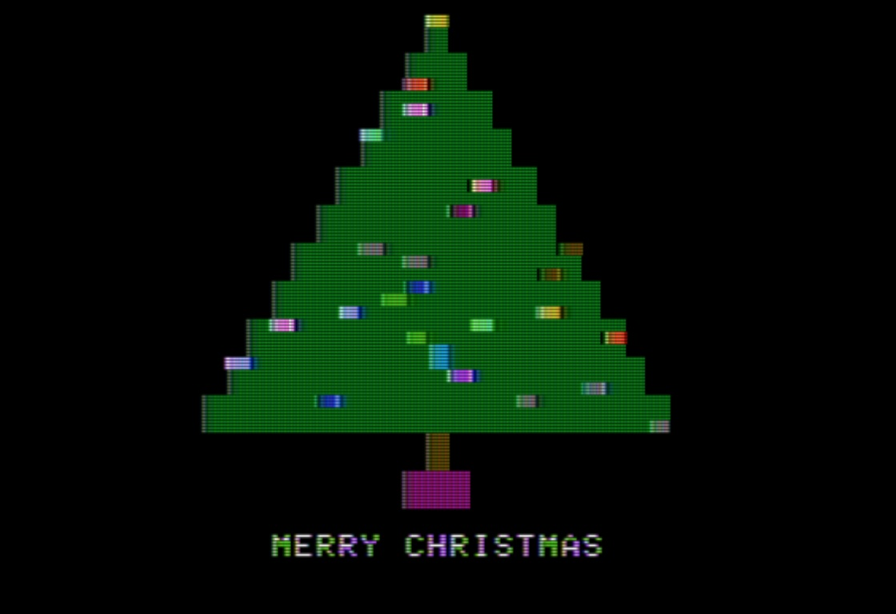

<!--
SPDX-FileCopyrightText: © 2025 Ryan Carsten Schmidt <https://github.com/ryandesign>
SPDX-License-Identifier: MIT
-->

This is an Apple II program written in AppleSoft BASIC that draws a Christmas
tree with blinking lights.

## Compatibility

It should work with any Apple II.

## License

 MIT license
