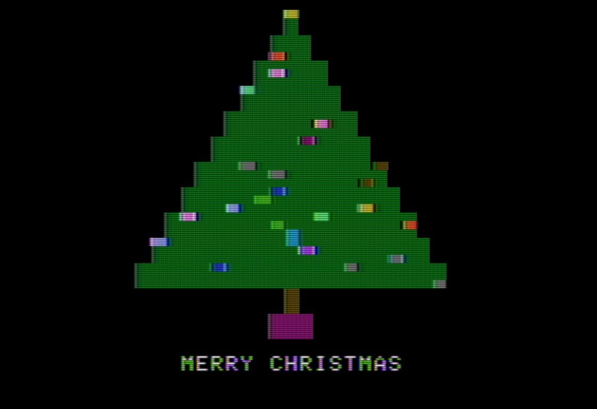

<!--
SPDX-FileCopyrightText: © 2025 Ryan Carsten Schmidt <https://github.com/ryandesign>
SPDX-License-Identifier: MIT
-->

xmastree is an Apple II program written in Applesoft BASIC that draws a
Christmas tree with blinking lights.

## Compatibility

xmastree should work with any Apple II.

## License

xmastree is released under the MIT license.
